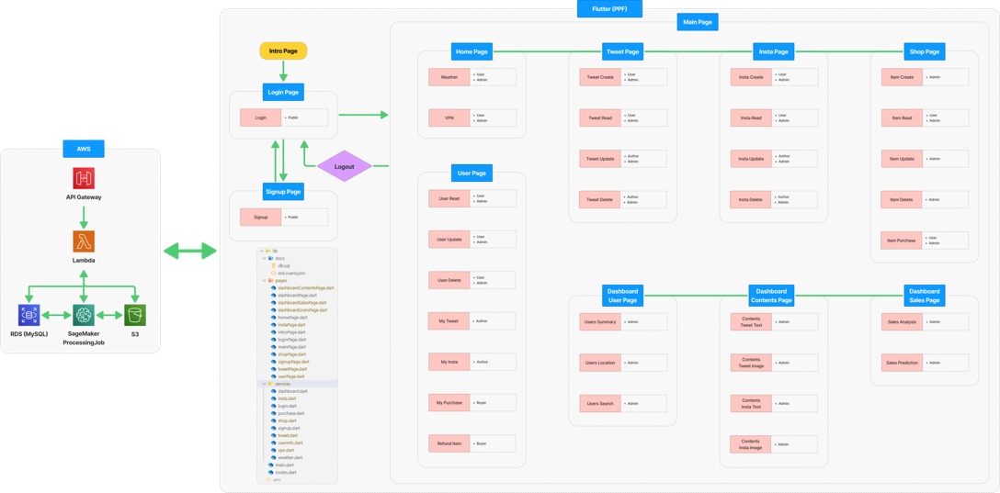
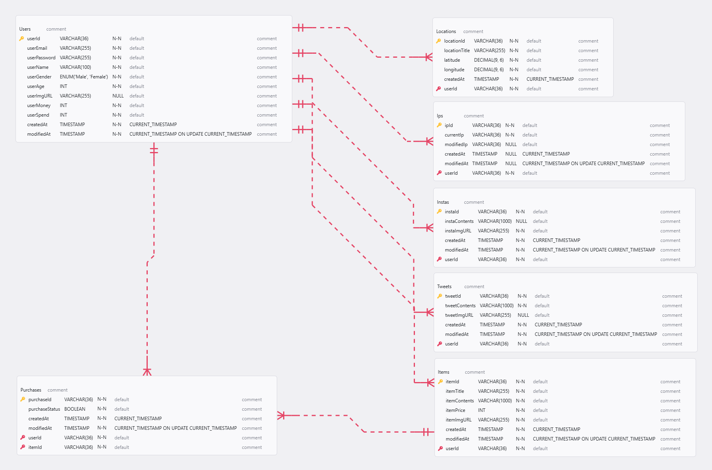
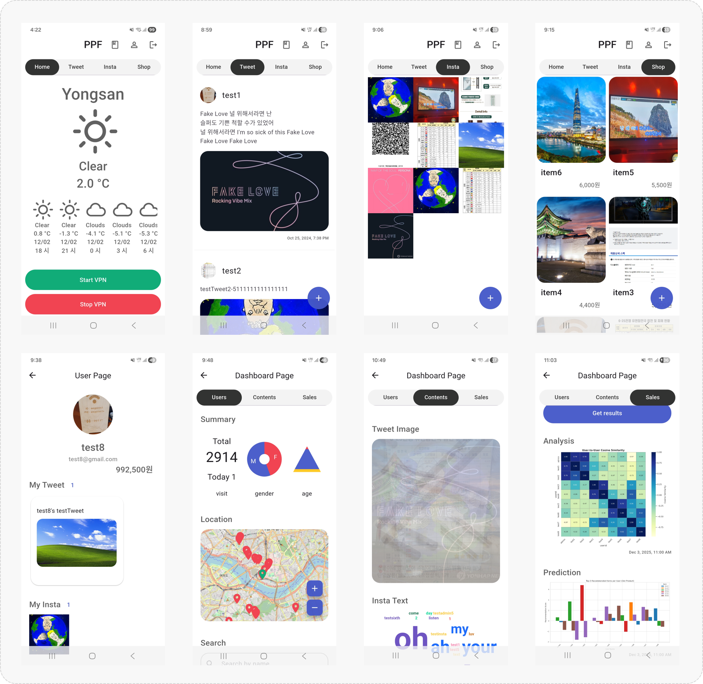

# 📱 PPF (Portfolio Project with Flutter & AWS)

---

## 📌 Overview

### Problem & Needs (문제 및 니즈)

- Need for a Super App : Integration of user services and enterprise data capabilities into a single platform.  
  (SNS·쇼핑 등 유저 기능과 데이터 관리·분석 등 기업 기능을 통합한 슈퍼앱 플랫폼의 필요)

### Solution & Impact (솔루션 및 기대효과)

- A Super App Integrating User and Enterprise Functions : A versatile, multi-functional platform designed for scalable future service expansion.  
  (유저 기능과 기업 기능을 통합한 슈퍼앱 : 향후 서비스 확장도 가능한 다기능 범용 플랫폼)

---

## 👤 Role & Responsibilities

### Full-stack IT Service Planner & Developer (풀스택 IT 서비스 기획자 & 개발자)

- Responsible for end-to-end planning, system architecture design, database modeling, frontend and backend development, cloud infrastructure integration, and ML feature implementation.  
  (프로젝트 전체 기획부터 시스템 아키텍처 설계, ERD 설계, 프론트엔드·백엔드 개발, AWS 클라우드 연동 및 ML 기능 통합까지 End-to-End로 담당)

---

## ⚙️ Tech Stack

- OS : Windows 11

- IDE : Visual Studio Code, Android Studio

- Target Platform : Android (Samsung Galaxy S22)

- Framework : Flutter (3.29.1)

- Languages : Dart (3.7.0), Python (3.10), Java (17.0.11), JavaScript, SQL

- Backend (AWS) : API Gateway, Lambda, RDS (MySQL), S3, SageMaker AI (ProcessingJob)

- Version Control : Git, GitHub

- Others : Figma, Photoshop, Canva

---

## 🔍 Rationale for Key Technology & Feature Choices

### Flutter

- Single codebase for Android & iOS enables reduced development and operational costs, and faster updates.  
  (단일 코드베이스로 Android·iOS 동시 대응으로 개발·운영 비용 최소화 및 업데이트 속도 향상)

### API

- Flexible interfaces for internal and external services minimize costs for future feature expansion.  
  (내부·외부 서비스 확장에 대비한 유연한 인터페이스 설계로 기능 확장 비용 절감)

### AWS Lambda

- Serverless architecture ensures fast response, automatic scaling, stable traffic handling, and cost optimization.  
  (서버리스 기반의 빠른 응답 속도 및 자동 확장으로 안정적 트래픽 처리 및 비용 최적화 가능)

### AWS RDS

- Relational DB chosen for reliable management of structured user, content, and product data.  
  (구조화된 사용자·콘텐츠·상품 데이터를 안정적으로 운영하기 위한 관계형 DB 선택)

### AWS S3

- High-availability storage and CDN-based delivery optimize large-scale content handling.  
  (이미지·콘텐츠의 고가용성 저장 및 CDN 기반 전송으로 대용량 콘텐츠 환경 최적화)

### AWS SageMaker

- Automates ML model training and inference; Processing Job-based analytics reduce latency and costs.  
  (머신러닝 모델 학습·추론 환경의 자동화 및 Processing Job 기반 분석 확장, 대기시간 및 비용 최적화)

### Signup / Login

- Structured user authentication and session management establish a robust service framework.  
  (유저 인증 및 세션 관리 기능을 통한 체계화된 서비스 기반 구조 확립)

### Weather

- Location-based information enhances user engagement and return rate.  
  (위치 기반 정보 제공을 통한 사용자 체류 시간 및 재방문율 향상)

### VPN

- Security and utility features reinforce DAU and revisit incentives.  
  (보안·유틸리티 제공을 통한 DAU 및 재방문 동기 강화)

### Tweet / Insta

- Implements content-driven service interactions including posts, feeds, and image uploads for major SNS.  
  (업계 주요 SNS들의 게시·피드·이미지 업로드 등 콘텐츠 기반 서비스 인터랙션 구조를 구현)

### Shop

- End-to-end e-commerce flow : product registration, modification, deletion, purchase, and refunds.  
  (상품 등록·수정·삭제·구매·환불 등 e커머스 엔드투엔드 흐름 구현)

### User Info

- Provides CRUD for user profiles and activity data, enhancing service experience and overall completeness.  
  (사용자 프로필 및 활동 데이터 RUD 기능 제공으로 서비스 경험을 강화하고 서비스 완성도를 높이기 위해 적용)

### Dashboard Users

- Aggregates and visualizes overall user data on a single screen to derive actionable insights.  
  (사용자 전체 데이터를 단일 화면에서 집계·분석하고 인사이트 도출을 위한 시각화 구현)

### Dashboard Contents

- Visualizes text and image data using word clouds and image overlays for advanced analysis.  
  (텍스트·이미지 데이터를 워드클라우드∙이미지 오버레이 방식으로 시각화하여 콘텐츠 소비 행태 분석 고도화)

### Dashboard Sales

- SageMaker-based user and sales analytics for growth strategies and personalized recommendations.  
  (SageMaker Processing Job 기반 분석을 통해 사용자·매출 통합 분석 및 개인화 추천을 통한 매출 성장 전략 설계)

---

## 🧱 System Architecture

- The system is built on a serverless AWS architecture. A Flutter-based mobile client communicates with backend services through Amazon API Gateway and AWS Lambda. Data is stored in Amazon RDS and S3, while analytics and machine learning workloads are processed using Amazon SageMaker.  
  (Flutter 모바일 앱을 클라이언트로 하여 API Gateway와 Lambda 기반의 서버리스 백엔드를 구성하였으며, RDS와 S3를 통해 데이터를 관리하고 SageMaker를 활용해 분석 및 ML 처리를 수행하는 구조)

---

## 🗂 Database (ERD)

- The relational database schema was designed to support user management, social content, e-commerce transactions, and analytics data, ensuring scalability and data integrity across multiple service domains.  
  (유저 관리, SNS 콘텐츠, 쇼핑 트랜잭션, 분석 데이터를 통합적으로 관리할 수 있도록 관계형 데이터베이스 구조를 설계하여 확장성과 데이터 정합성을 확보)

---

## 🖥 Main Features

### Signup / Login

- User registration, authentication, and session management  
  (회원가입, 로그인 및 세션 관리 기능)

### Weather / VPN

- Location-based weather forecasting and VPN functionality  
  (위치 기반 일기 예보 기능 및 VPN 기능)

### Tweet

- Twitter style SNS with full CRUD operations  
  (트위터 스타일 SNS의 CRUD 기능)

### Insta

- Instagram style SNS with image-based CRUD operations  
  (인스타그램 스타일 SNS의 CRUD 기능)

### Shop

- Product management, purchase, and transaction processing  
  (쇼핑 채널의 CRUD 및 구매 기능)

### User Info

- User information management (RUD) and order cancellation  
  (유저 페이지의 유저 RUD 및 구매 취소 기능)

### Dashboard Users

- Analysis of user profiles and behavioral patterns  
  (유저 정보 및 행동 특성 분석)

### Dashboard Contents

- Content analysis using word clouds and image overlays  
  (워드클라우드 및 이미지 오버레이로 컨텐츠 분석)

### Dashboard Sales

- Revenue analysis using similarity heatmaps and Top-N recommendation graphs  
  (유사도 히트맵 및 Top-N 추천 그래프로 매출 관리 및 분석)

---

## 🖼 Screen Shots

---

## 📅 Timeline

| 기간              | 주요 작업                                       |
| ----------------- | ----------------------------------------------- |
| 2024.06 - 2024.07 | Planning & System Design (기획 및 설계)         |
| 2024.07 - 2024.08 | App Development & Setup (기본 앱 개발 및 세팅)  |
| 2024.08 - 2024.09 | Feature Expansion (기능 확장)                   |
| 2024.10 - 2024.12 | Optimization & Stabilization (최적화 및 안정화) |
| 2025.01 - 2025.04 | ML Feature Integration (ML 기능 통합)           |
| 2025.05 - 2025.08 | Operations & Maintenance (운영 및 유지 보수)    |

---

## 🔗 External Resources

### Wireframe (Figma)

- https://www.figma.com/design/qokFuaMidfvWIZtHE8pn3o/Portfolio-Projects?node-id=2-2&t=Tf7gzTz6iSkaWlHf-1

### Demo Video (YouTube)

- https://youtu.be/jz8e4Ejg8G0

---
